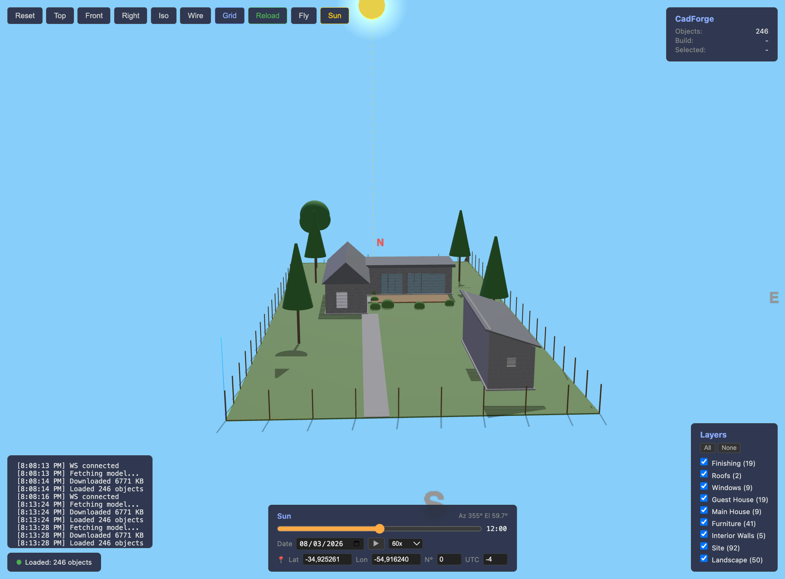

# CadForge



A modular CAD framework built on top of FreeCAD's OpenCASCADE geometry engine. Define building modules in Python, compile headless via FreeCADCmd, export to glTF, and preview in a browser-based 3D viewer with hot reload.

## Features

- **Headless builds** -- runs FreeCADCmd as a subprocess, no GUI required
- **AST validation** -- static analysis of all modules before invoking FreeCAD, catches syntax errors and missing `build(doc)` functions instantly
- **Browser viewer** -- three.js-based 3D viewer served over HTTP, loads GLB models with per-object colors and transparency
- **Hot reload** -- file watcher detects changes in `project/`, rebuilds, and pushes updates to the viewer over WebSocket
- **Fly mode** -- first-person WASD navigation with mouse look and adjustable speed
- **Layer groups** -- toggle visibility of module groups (site, house, interior, exterior) independently
- **Object picking** -- click any object in the viewer to inspect its name and highlight it
- **MCP integration** -- Model Context Protocol server lets AI agents read, write, validate, and build modules programmatically

## Quick Start

### Prerequisites

Install FreeCAD 1.0+ so that `freecadcmd` is available. On macOS it ships at:

```
/Applications/FreeCAD.app/Contents/Resources/bin/freecadcmd
```

### Install

```bash
pip install trimesh numpy websockets
```

Clone the repository and make sure `cadforge.toml` is at the project root.

### Build

```bash
python -m cadforge build
```

This runs three phases: AST validation, headless FreeCAD build, and STL-to-GLB conversion. Output lands in `dist/`.

### Dev Server

```bash
python -m cadforge dev
```

Opens a browser at `http://localhost:3131` with the 3D viewer. Edit any file under `project/` and the model rebuilds and reloads automatically.

## Architecture

```
project/                         cadforge/
+-----------+                   +-----------+
| config.py |  dimensions,      | manifest  |  reads cadforge.toml
| helpers.py|  colors, utils    |           |
+-----+-----+                   +-----+-----+
      |                               |
      v                               v
+-----+-----+                   +-----+-----+
| module.py |  build(doc) -->   | compiler  |  Phase 1: AST validation
| module.py |                   |           |
| module.py |                   +-----+-----+
+-----+-----+                         |
      |                               v
      |                         +-----+-----+
      +------------------------>| engine    |  Phase 2: generate Python script
                                |           |  and run in FreeCADCmd subprocess
                                +-----+-----+
                                      |
                                      v
                                +-----+-----+
                                | exporter  |  Phase 3: STL --> trimesh --> GLB
                                +-----+-----+
                                      |
                                      v
                                +-----+-----+
                                | server    |  HTTP + WebSocket
                                +-----+-----+
                                      |
                                      v
                                +-----+-----+
                                | viewer    |  three.js (index.html)
                                | (browser) |  loads /dist/model.glb
                                +-----------+
```

## Project Structure

```
cadforge.toml           # project manifest -- modules, export, dev server config
cadforge/               # framework core
    __init__.py
    cli.py              # CLI entry point (build, validate, dev, export)
    manifest.py         # reads and validates cadforge.toml
    compiler.py         # AST validation + orchestrates build pipeline
    engine.py           # headless FreeCADCmd subprocess runner
    exporter.py         # STL to GLB conversion via trimesh
    server.py           # HTTP server + WebSocket for hot reload
    watcher.py          # file change detection (polling-based, no dependencies)
    mcp_server.py       # MCP server for AI-driven CAD
viewer/
    index.html          # three.js viewer (served at /)
project/                # user-defined CAD modules
    config.py           # all dimensions, colors, constants
    helpers.py          # FreeCAD utilities (add_obj, make_box, box_walls, etc.)
    build.py            # standalone build script (FreeCAD macro)
    site/               # ground, landscape modules
    houses/             # main_house, guest_house modules
    interior/           # walls, furniture modules
    exterior/           # roofs, windows, finishing modules
dist/                   # build output (model.glb, manifest.json)
```

## Module API

Every module must export a `build(doc)` function that receives a FreeCAD document and adds geometry to it.

```python
# project/houses/main_house.py
from project.config import AX, AY, A_W, A_D, WALL_H, COL_SIDING
from project.helpers import add_obj, make_box

def build(doc):
    slab = make_box(AX, AY, 0, A_W, A_D, 100)
    add_obj(doc, "MainSlab", slab, COL_SIDING)
```

### config.py

Central parameter file. All dimensions, positions, and colors live here. Change a value and the entire project rebuilds to match.

```python
M = 1000          # meters to mm conversion

PLOT_W = 22 * M   # plot width
WALL_H = 2.8 * M  # wall height
COL_SIDING = (0.55, 0.55, 0.57)  # RGB float tuple
```

### helpers.py

Utility functions available to all modules:

| Function | Description |
|----------|-------------|
| `add_obj(doc, name, shape, color, transp=0)` | Add a Part::Feature to the document with color metadata |
| `make_box(x, y, z, w, d, h)` | Create a translated box shape |
| `box_walls(x, y, w, d, h, t, z_base=0)` | Create hollow walls (outer box minus inner box) |
| `wcut(x, y, z, w, h, depth, axis)` | Create a window/door cutout shape |
| `iwall(x1, y1, x2, y2, t, h, z_base=0)` | Create an interior wall between two points |

Colors are stored as a `CadForgeColor` string property on each object (`"r,g,b;transparency"`), which survives headless mode and gets picked up by the exporter.

## cadforge.toml Reference

```toml
[project]
name = "house-88m2"          # project name
units = "mm"                 # coordinate units
freecad = "/path/to/freecadcmd"  # path to FreeCADCmd binary
project_dir = "project"      # directory containing modules

[modules]
sequence = [                 # build order (dependencies first)
    "site.ground",
    "site.landscape",
    "houses.main_house",
    "houses.guest_house",
    "interior.walls",
    "interior.furniture",
    "exterior.roofs",
    "exterior.windows",
    "exterior.finishing",
]

[export]
formats = ["stl", "gltf"]   # output formats
mesh_deflection = 0.5        # tessellation quality (lower = finer)
output_dir = "dist"          # build output directory

[dev]
port = 3131                  # HTTP server port
ws_port = 3132               # WebSocket port for hot reload
watch = ["project/**/*.py"]  # file patterns to watch
auto_open = true             # open browser on start
debounce_ms = 500            # delay before rebuild after file change
```

## CLI Commands

```
cadforge build [--keep-stl]   Validate, build, and export. --keep-stl retains
                              individual STL files alongside the merged GLB.

cadforge validate             Run AST validation only (no FreeCAD needed).
                              Checks syntax, verifies build(doc) exists in
                              every module, warns about missing __init__.py.

cadforge dev                  Start dev server with hot reload.
                              Performs initial build, serves viewer, watches
                              project/ for changes.

cadforge export               Convert existing STL files in dist/ to GLB.
```

Pass `--root /path/to/project` to any command to specify the project root (defaults to current directory).

## Viewer Controls

### Orbit Mode (default)

- **Left-click drag** -- rotate around target
- **Right-click drag** -- pan
- **Scroll wheel** -- zoom
- **Click on object** -- select and highlight, name shown in info panel

### Fly Mode (press Fly button or toggle)

- **W / Arrow Up** -- move forward (along camera direction)
- **S / Arrow Down** -- move backward
- **A / Arrow Left** -- strafe left
- **D / Arrow Right** -- strafe right
- **Q / Space** -- move up (world Z)
- **E** -- move down (world Z)
- **Mouse** -- look around (pointer lock)
- **Shift** -- 5x speed boost
- **+/-** or **scroll wheel** -- adjust base speed
- **Esc** -- exit fly mode

### Toolbar

- **Reset** -- fit camera to model bounds
- **Top / Front / Right / Iso** -- preset camera angles (Z-up coordinate system)
- **Wire** -- toggle wireframe rendering
- **Grid** -- toggle ground grid
- **Reload** -- manually reload the GLB model

### Layers Panel

Toggle visibility of module groups independently. Groups correspond to module paths in `cadforge.toml` (e.g., `site.ground`, `houses.main_house`). Use the All/None buttons to bulk toggle.

## MCP Integration

CadForge includes a Model Context Protocol server that allows AI agents (such as Claude) to drive the CAD pipeline programmatically.

### Setup

```bash
pip install mcp
python -m cadforge.mcp_server
```

Or add to your MCP client configuration:

```json
{
  "mcpServers": {
    "cadforge": {
      "command": "python",
      "args": ["-m", "cadforge.mcp_server"]
    }
  }
}
```

### Available Tools

| Tool | Description |
|------|-------------|
| `cadforge_build(formats)` | Full build pipeline: validate, build, export. Returns status, error list, object count, and build time. |
| `cadforge_validate()` | AST validation only. Fast, does not require FreeCAD. |
| `cadforge_read_module(module)` | Read source code of a module (e.g., `"houses.main_house"`). |
| `cadforge_write_module(module, code)` | Write or update a module. Validates syntax before saving. |
| `cadforge_read_config()` | Read the current `config.py` parameters. |
| `cadforge_list_modules()` | List all modules from `cadforge.toml`. |
| `cadforge_list_objects()` | List objects from the last build with names, colors, and volumes. |

### Workflow

A typical AI-driven workflow:

1. `cadforge_list_modules` -- understand project structure
2. `cadforge_read_config` -- read current dimensions and colors
3. `cadforge_read_module("houses.main_house")` -- read existing code
4. `cadforge_write_module("houses.main_house", updated_code)` -- modify geometry
5. `cadforge_build()` -- rebuild and export

If the dev server is running, the viewer updates automatically after each build.

## Requirements

- **FreeCAD** 1.0+ (provides `freecadcmd` binary and OpenCASCADE kernel)
- **Python** 3.11+
- **trimesh** + **numpy** -- STL to GLB conversion
- **websockets** -- hot reload (optional, dev server works without it)
- **macOS** or **Linux** (Windows may work but is untested)

## Roadmap

### v0.2 — Incremental Builds
- Dependency graph between modules (skip unchanged modules on rebuild)
- Persistent FreeCADCmd process with stdin/stdout protocol for sub-second rebuilds
- Build cache with hash-based invalidation per module
- Parallel module compilation for independent branches

### v0.3 — Viewer Pro
- Measurement tool (click two points to see distance)
- Section plane / clipping box to inspect interiors
- Dimension annotations overlay from config.py values
- Screenshot and turntable video export
- Dark/light theme toggle
- Touch controls for mobile/tablet

### v0.4 — Component Library
- Reusable parametric components (doors, windows, stairs, furniture)
- Component registry with search and preview
- `cadforge add window --width 1.2 --height 1.4` CLI for scaffolding
- Snap/alignment system for placing components relative to walls

### v0.5 — Multi-format Export
- IFC export for BIM interoperability
- DXF/DWG floor plan generation from 3D model
- PDF floor plans with auto-dimensioning (replace matplotlib approach)
- USDZ export for Apple Quick Look / AR preview
- Blender integration (direct .blend export with materials)

### v0.6 — Collaboration
- Project diffing — visual 3D diff between two builds
- Git-friendly module format with merge support
- Comments and annotations anchored to 3D positions
- Shared dev server with multi-user cursor presence

### v0.7 — Advanced Geometry
- CSG tree inspector in viewer (visualize boolean operations)
- Parametric constraints engine (wall A must align with wall B)
- Terrain import from GeoTIFF / point cloud
- Structural analysis integration (load paths, span checks)

### v1.0 — Production
- Plugin system for custom build steps and exporters
- CI/CD integration (GitHub Actions for automated builds and previews)
- Hosted viewer with shareable links (static deploy to Vercel/Netlify)
- Comprehensive test suite and API stability guarantees
- Windows support and cross-platform installer

## License

See LICENSE file for details.
